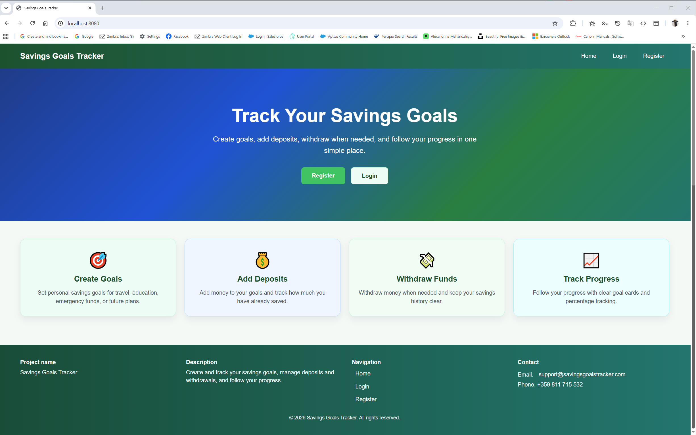
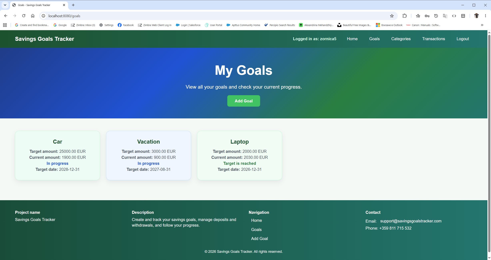
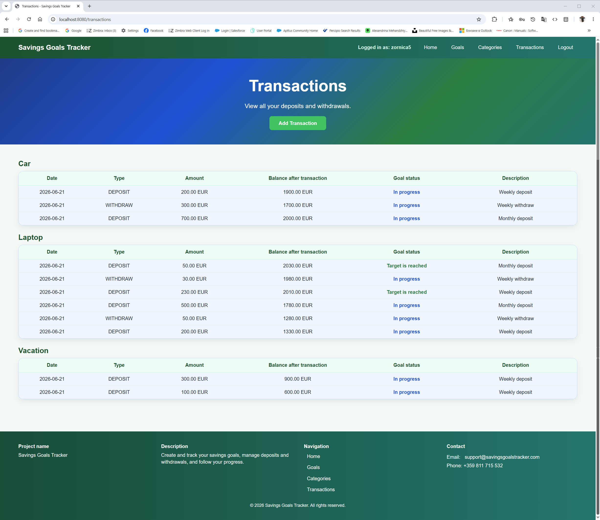
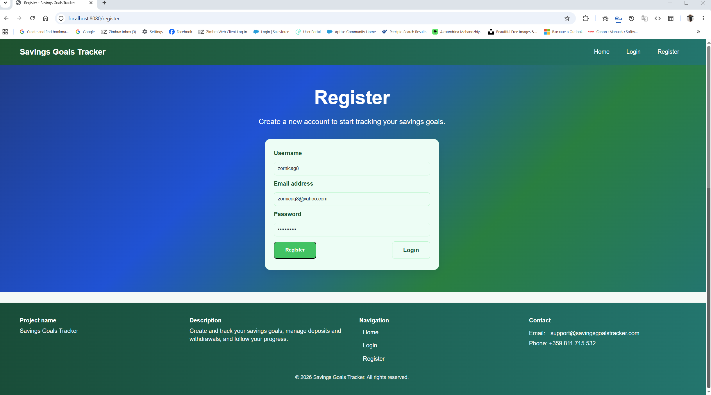
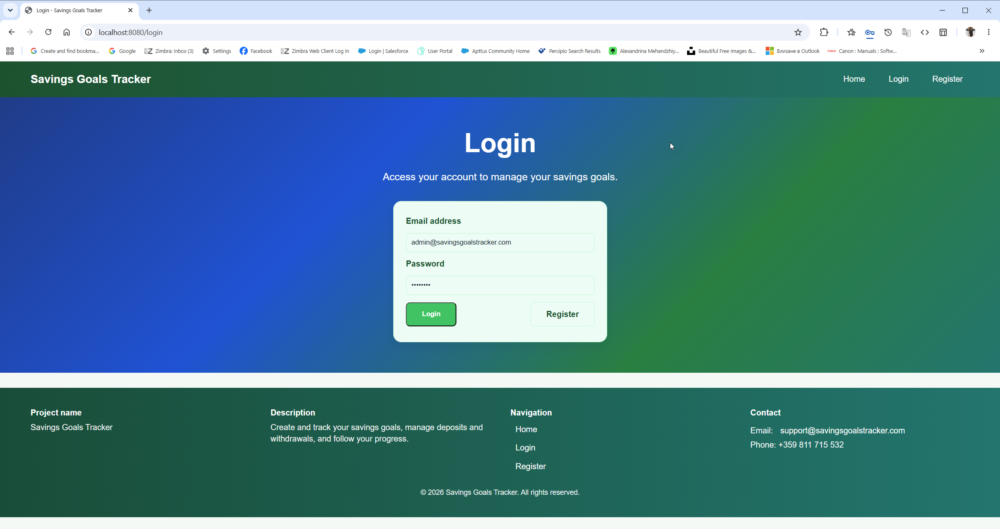
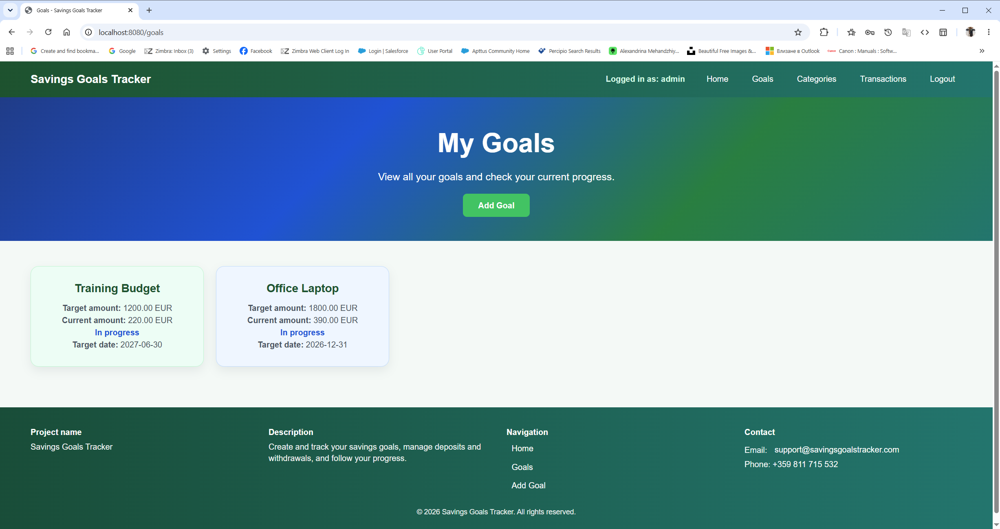
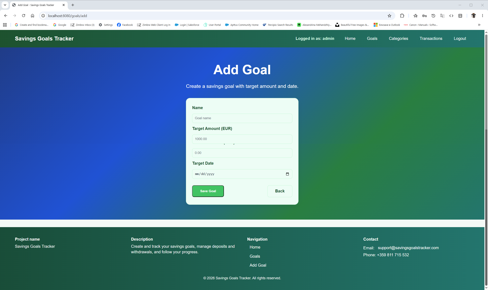
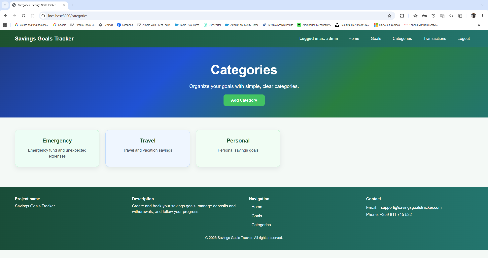
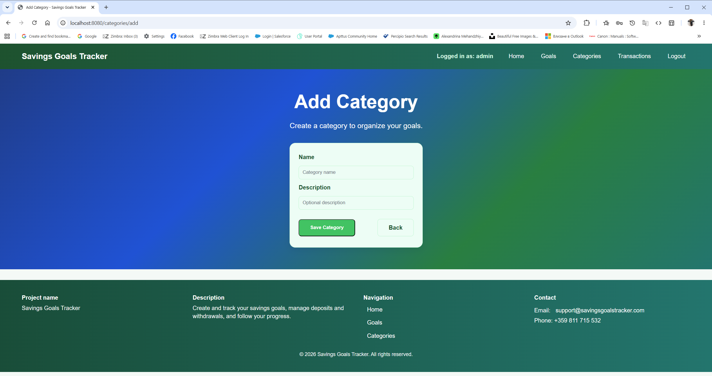
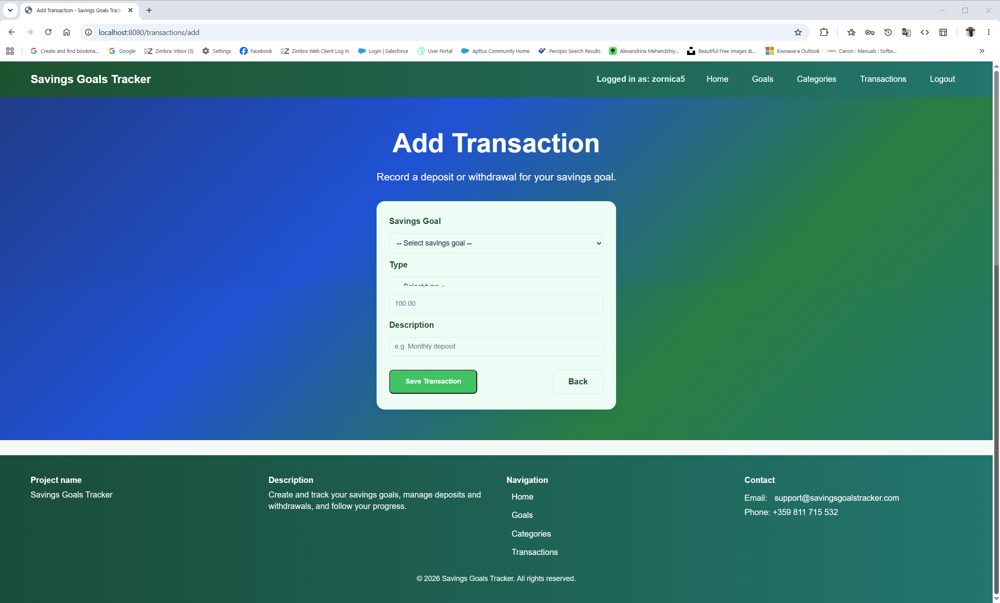

<p align="center">
  
  
  
</p>

# Savings Goals Tracker

GitHub repository: https://github.com/zornicag/savings-goals-tracker

## 1. Project Title

Savings Goals Tracker

## 2. Overview

Savings Goals Tracker is a Spring Boot web application for managing personal savings goals. Users can register, log in, create categories, create savings goals, add deposits, make withdrawals, and track goal progress.

The application uses session-based authentication, supports user roles, and keeps all goals and transactions tied to the logged-in user.

## 3. Features

* User registration and login
* Custom session-based authentication
* Password encoding with `PasswordEncoder`
* User roles: `USER` and `ADMIN`
* Admin user initializer
* Categories
* Savings goals
* Transactions
* Deposit and withdraw
* Balance tracking
* Goal status: `In progress` / `Target is reached`
* Logged-in username shown in the header
* User-specific goals and transactions

## 4. Technology Stack

* Java 17
* Spring Boot
* Spring MVC
* Thymeleaf
* Spring Data JPA
* MySQL
* Maven
* Lombok
* HTML
* CSS

## 5. Project Structure

```text
src/main/java/app
├── config
│   ├── AdminUserInitializer.java
│   └── BeanConfiguration.java
├── mapper
│   └── user
│       └── UserMapper.java
├── model
│   ├── dto
│   │   ├── category
│   │   │   └── CategoryForm.java
│   │   ├── savingsgoal
│   │   │   └── SavingsGoalForm.java
│   │   ├── transaction
│   │   │   └── TransactionForm.java
│   │   └── user
│   │       ├── UserDto.java
│   │       ├── UserLoginRequest.java
│   │       └── UserRegisterRequest.java
│   └── entity
│       ├── category
│       │   └── Category.java
│       ├── savingsgoal
│       │   └── SavingsGoal.java
│       ├── transaction
│       │   ├── Transaction.java
│       │   └── TransactionType.java
│       └── user
│           ├── User.java
│           └── UserRole.java
├── repository
│   ├── category
│   │   └── CategoryRepository.java
│   ├── savingsgoal
│   │   └── SavingsGoalRepository.java
│   ├── transaction
│   │   └── TransactionRepository.java
│   └── user
│       └── UserRepository.java
├── service
│   ├── category
│   │   └── CategoryService.java
│   ├── savingsgoal
│   │   └── SavingsGoalService.java
│   ├── transaction
│   │   └── TransactionService.java
│   └── user
│       └── UserService.java
└── web
    ├── CategoryController.java
    ├── IndexController.java
    ├── SavingsGoalController.java
    ├── TransactionController.java
    └── UserController.java

src/main/resources
├── static
│   └── css
│       └── style.css
├── templates
│   ├── categories.html
│   ├── category-add.html
│   ├── goal-add.html
│   ├── goals.html
│   ├── home.html
│   ├── index.html
│   ├── login.html
│   ├── register.html
│   ├── transaction-add.html
│   └── transactions.html
└── application-dev.properties

src/test/java/app
└── SavingsGoalsTrackerApplicationTests.java
```

## 6. Screenshots

### Home Page


### Register Page


### Login Page


### Admin Goals Page


### Add Goal Page


### Categories Page


### Add Category Page


### Transactions Page


### Add Transaction Page


### Goal Status Progress


## 7. How to Run

1. Clone the repository.
2. Open the project in IntelliJ IDEA.
3. Create and configure a MySQL database.
4. Update `src/main/resources/application-dev.properties`.
5. Run `mvn clean install -DskipTests`.
6. Start the Spring Boot application.
7. Open `http://localhost:8080`.

## 8. Default Admin User

* username: `admin`
* email: [admin@savingsgoalstracker.com](mailto:admin@savingsgoalstracker.com)
* password is configured in `application-dev.properties` with `app.admin.password`

## 9. Future Improvements

Possible future improvements include charts, filtering, and more detailed admin functionality.
